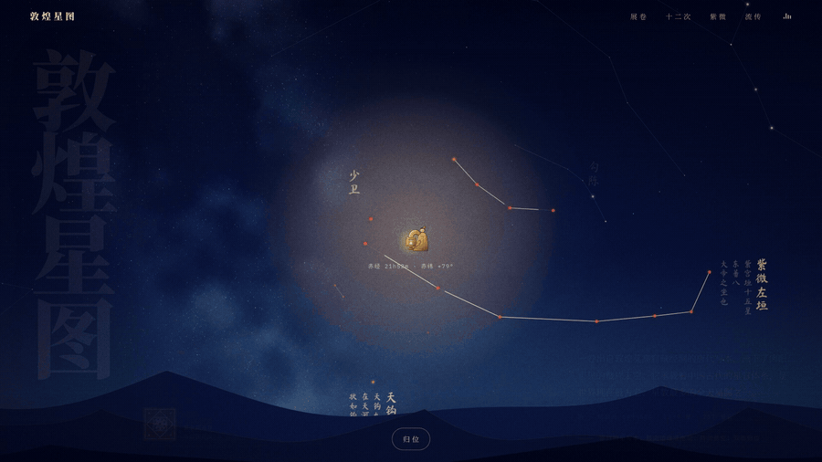
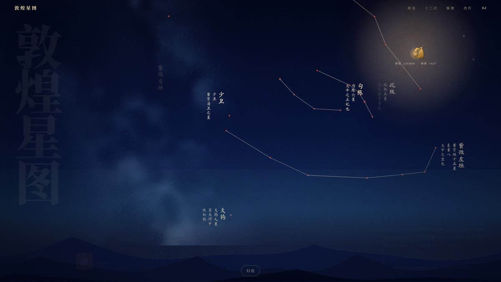
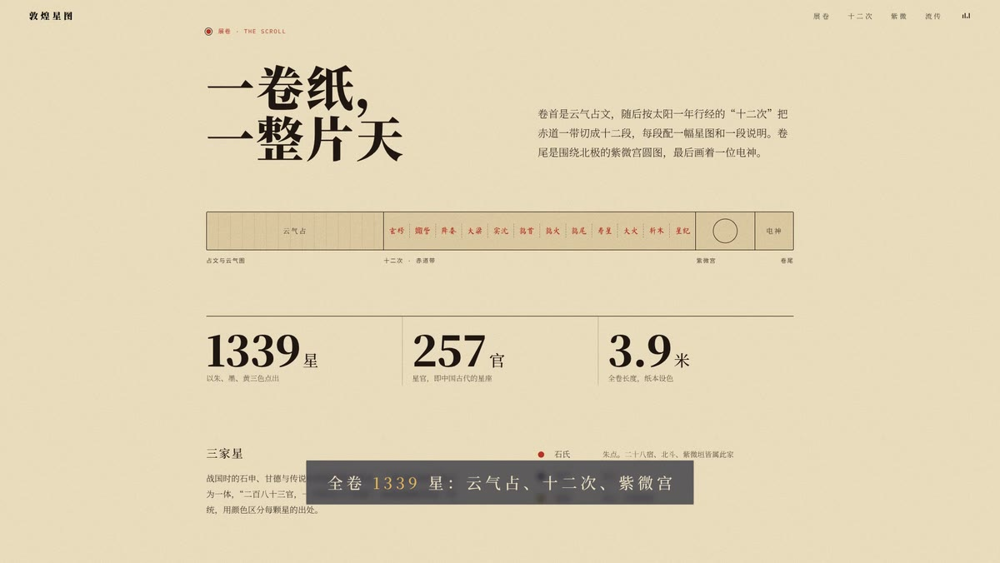
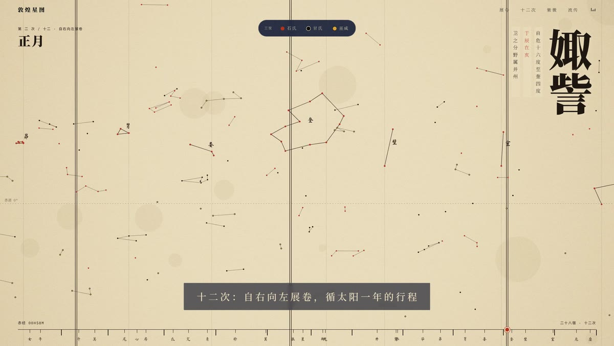
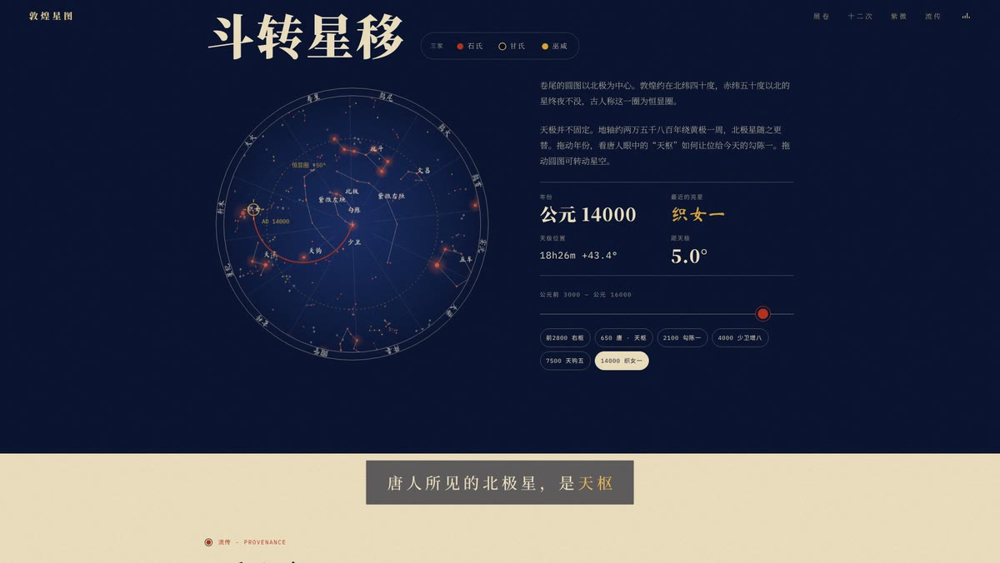

<div align="center">

# 敦煌星图 · Dunhuang Sky

**观乎天文，以察时变**

一个以唐代敦煌星图为主题的沉浸式交互网站。<br>
掌一盏长信宫灯，照见一千三百年前的星空写本。

[**在线访问 →**](https://daoyi2026.github.io/dunhuang-sky/)　·　[产品视频](docs/dunhuang-sky.mp4)

<a href="https://daoyi2026.github.io/dunhuang-sky/"></a>

</div>

## 关于敦煌星图

敦煌星图出自敦煌莫高窟藏经洞，绘于唐初（约公元 649–684 年），是世界现存最古老、星数最多的全天星图之一。全卷先列云气占文，再按太阳一年行经的“十二次”把赤道一带分成十二段，各配星图与说明，卷末是以北极为中心的紫微宫圆图。图中 1339 颗星分属 257 个星官，用朱、墨、黄三色区分石氏、甘氏、巫咸三家星官体系。

这个网站把这卷星图重新放回夜空：每颗星都按真实星位绘出，星官名、十二次、分野与题记都来自中国古代天文典籍。

## 四个篇章

| | |
|---|---|
|  | **掌灯观星**<br>首屏是一整个可以转动的天球。手持长信宫灯，灯光所及之处，夜空化作写本：星官以朱、墨、黄三色逐笔画出，旁边竖写《晋书·天文志》的题记。灯移到画面边缘，天穹随之转动；双击或点「归位」回到牛郎织女。 |
|  | **展卷**<br>全卷的结构、星数与三家星的配色体系。 |
|  | **十二次长卷**<br>页面固定，星图自右向左展开，和原卷的阅读方向一致。从玄枵到星纪，每一次显示起讫宿度、地支、月份与分野；可按石氏、甘氏、巫咸筛选星点。 |
|  | **斗转星移**<br>以北天极为中心的紫微宫圆图，可拖动旋转。拨动年份，看天极沿岁差圈移动：唐人所见的北极星是天枢，今天是勾陈一，一万多年后将是织女一。 |

## 细节

- **真实天空**：二十八宿、北斗、紫微垣等主要星官按 J2000 星表实测位置绘制，立体投影呈现完整天球；银河按真实银道面位置生成，约十一万颗微星构成，暗尘带与银心暖色清晰可辨。
- **岁差**：紫微宫圆图实时计算天极位置，覆盖公元前 3000 年到公元 16000 年。
- **文化元素**：光标是西汉长信宫灯，印章取莫高窟藻井“斗四莲花”纹样，首屏题字“观乎天文，以察时变”出自《周易·贲卦》。
- **配乐**：古琴曲《神人畅》，进入页面后第一次点击或触摸即响起，右上角可静音。

## 本地运行

单个静态 HTML 文件，没有构建步骤，也不依赖任何框架。

```bash
git clone https://github.com/daoyi2026/dunhuang-sky.git
cd dunhuang-sky
python3 -m http.server 8000
# 浏览器打开 http://localhost:8000
```

也可以直接双击 `index.html` 打开（配乐需要通过本地服务器访问才能加载）。

## 技术

- 原生 HTML / CSS / JavaScript，Canvas 2D 绘制全部星空
- 配乐用原生 audio 元素播放；字体来自 Google Fonts（思源宋体、马善政毛笔、IBM Plex Mono）
- 支持桌面与手机，尊重系统的“减少动态效果”设置

## 来源与授权

- **星位**：现代星表（J2000 历元）中各星官的主要成员；其余细小星点为示意分布，用以呈现原图三色星点的质感。
- **文字**：十二次起讫度数、分野与月份依《晋书·天文志》与原卷说明；星官题记节录自《晋书·天文志》。
- **配乐**：`shenren-chang.mp3`，古琴曲《神人畅》（据明代《西麓堂琴统》，1549），Charlie Huang 演奏，2006 年录制。原始录音来自 [Wikimedia Commons](https://commons.wikimedia.org/wiki/File:Shenren_Chang.ogg)，以 [CC BY-SA 2.5](https://creativecommons.org/licenses/by-sa/2.5/) 授权；本仓库中的版本经过降噪、响度统一和首尾淡入淡出处理，同样以 CC BY-SA 2.5 授权发布。
